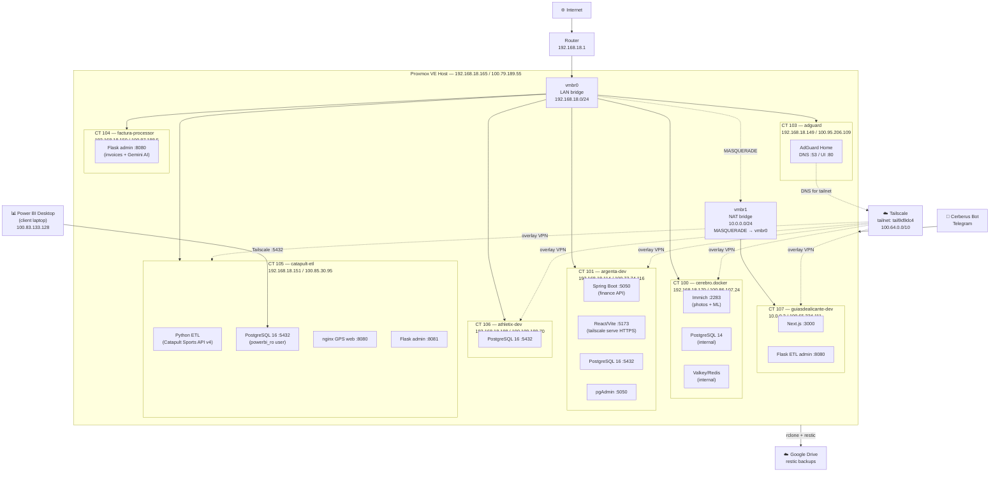

# homelab

Personal homelab running on a single Proxmox VE node. Self-hosted photo management, DNS blocking, finance management, sports data pipelines, and development environments — all connected over Tailscale.

---

## Hardware

| Component | Spec |
|-----------|------|
| Hypervisor | Proxmox VE 8 |
| vCPU | Shared (8 cores available) |
| RAM | ~16 GB total |
| Storage | Local LVM + NAS mount (`/mnt/pve/almacenamiento`) |
| GPU passthrough | Intel iGPU (`/dev/dri/renderD128`) — used by Immich ML |

---

## Architecture



### ASCII summary

```
Internet ──► Router (192.168.18.1)
                │
                ▼
         vmbr0 (LAN 192.168.18.0/24)
         ├── PVE host  .165 / Tailscale 100.79.189.55
         ├── CT 100    .170 / 100.86.107.24  Immich
         ├── CT 101    .114 / 100.72.74.116  Argenta dev
         ├── CT 103    .149 / 100.95.206.109 AdGuard DNS
         ├── CT 104    .150 / 100.87.188.5   Facturas
         ├── CT 105    .151 / 100.85.30.95   Catapult ETL
         └── CT 106    .198 / 100.109.199.70 Athletix DB

         vmbr1 (NAT 10.0.0.0/24) MASQUERADE ──► vmbr0
         └── CT 107    10.0.0.2 / 100.65.234.111 Guías Alicante
```

---

## Containers

| CT | Hostname | OS | Purpose |
|----|----------|----|---------|
| 100 | cerebro.docker | Debian 12 | Immich photo server (Docker) |
| 101 | argenta-dev | Debian 12 | Personal finance app (Spring Boot + React) |
| 103 | adguard | Debian 12 | AdGuard Home — network-wide DNS blocker |
| 104 | factura-processor | Debian 12 | Invoice processor (Python + Gemini AI + SQLite) |
| 105 | catapult-etl | Debian 12 | GPS sports data ETL → PostgreSQL (Power BI) |
| 106 | athletix-dev | Debian 12 | Athlete monitoring system DB (PostgreSQL 16) |
| 107 | guiasdealicante-dev | Debian 12 | Tourist guides web app (Next.js + NAT) |

---

## Services exposed via Tailscale

| Service | URL | Notes |
|---------|-----|-------|
| Immich | `http://100.86.107.24:2283` | Self-hosted photo backup |
| Argenta frontend | `https://argenta-dev.tail9d9dc4.ts.net` | `tailscale serve` HTTPS |
| AdGuard Home UI | `http://192.168.18.149` | DNS stats + blocklists |
| Catapult admin | `http://100.85.30.95:8081/admin` | ETL config + logs |
| Catapult GPS web | `http://100.85.30.95:8080` | CSV export for coaches |
| Catapult PostgreSQL | `100.85.30.95:5432` | Power BI read-only connection |
| Factura admin | `http://100.87.188.5:8080` | Invoice management panel |
| Proxmox UI | `http://100.79.189.55:8006` | Hypervisor dashboard |
| Control panel | `http://100.79.189.55:8090` | Custom services + docs dashboard |

---

## Stack Overview

### CT 100 — Immich
Self-hosted Google Photos alternative. Docker Compose stack: `immich-server`, `immich-machine-learning` (OpenVINO), PostgreSQL 14 (with pgvectors), Valkey (Redis).

Media stored on NAS mount (`/datos`). Port bound to Tailscale IP only — not reachable from LAN without Tailscale.

Intel iGPU passed through for hardware transcoding and ML acceleration.

### CT 101 — Argenta (dev)
Personal finance MVP. Spring Boot 3.4 backend (Java 21) + React/Vite frontend. PostgreSQL 16 + pgAdmin via Docker Compose. Backend and frontend managed with PM2. Exposed internally via `tailscale serve` for HTTPS dev access.

### CT 103 — AdGuard Home
Network-wide DNS blocker and resolver. Upstream: `https://dns.cloudflare.com/dns-query` (DoH). Serves the entire Tailscale network as DNS.

### CT 104 — Factura Processor
Python Flask app that downloads PDF invoices from Gmail (OAuth2), extracts structured data with Gemini Flash (fallback: Pro), and stores results in SQLite. Includes a web admin panel. Runs as a systemd service.

### CT 105 — Catapult ETL
Python ETL pipeline: pulls GPS session data from the Catapult Sports API v4 and upserts it into PostgreSQL 16. Four teams tracked. Power BI Desktop connects directly via Tailscale to a read-only `powerbi_ro` user. Web UI for coaches (CSV export + manual refresh) and admin panel for configuration. Cron: 4x/day (06:00, 12:00, 18:00, 23:00).

### CT 106 — Athletix DB
PostgreSQL 16 database container for the Athletix athlete monitoring system (in development). Isolated Docker Compose stack with a read-only role provisioned at init.

### CT 107 — Guías de Alicante (dev)
Next.js web app for a tourist guides platform. Connected via internal NAT bridge (vmbr1) to work around router MAC filtering. Exposed via Tailscale. Runs a Flask ETL admin panel alongside the Next.js dev server.

---

## Network Design Notes

**No VLANs.** Flat LAN with all containers on `vmbr0`. Traffic isolation is handled at the application layer (ports bound to specific IPs, Tailscale ACLs) rather than L2 segmentation.

**NAT bridge (vmbr1).** The ISP router rejects DHCP for unknown MACs beyond a certain count. CT 107 is on a host-internal bridge; Proxmox does MASQUERADE so the router only sees the host's MAC.

**Tailscale as overlay VPN.** Zero open inbound ports on the router — all remote access goes through Tailscale. Sensitive services (Immich, PostgreSQL, admin panels) are only reachable within the tailnet.

**SSL on internal services.** Not deployed (traffic already encrypted by Tailscale). `tailscale serve` provides HTTPS for the Argenta dev frontend.

---

## Backup Strategy

- **Data backup:** `restic` via `rclone` to Google Drive (`gdrive:Backups/Cerebro`). Source: `/mnt/pve/almacenamiento/datos`. Runs nightly at 03:00 via cron. Retention: 7 daily + 4 weekly snapshots.
- **CT snapshots:** Proxmox `vzdump` snapshots of CT 104 (invoices + SQLite DB) every Sunday at 02:00. Stored on local `almacenamiento` storage, 4 copies.
- **Encryption:** restic repository encrypted with a password file at `/root/scripts/.restic_pw`.

```bash
# Check latest backup status
restic -r rclone:gdrive:Backups/Cerebro -p /root/scripts/.restic_pw snapshots

# Verify integrity
restic -r rclone:gdrive:Backups/Cerebro -p /root/scripts/.restic_pw check
```

---

## Management Tools

- **Cerberus Bot** — Telegram bot running on PVE host (`/root/scripts/cerberus_bot.py`). Commands: `/status`, `/cpu`, `/startct`, `/stopct`, `/restart`, `/logs`, `/backup`, `/alertas`, `/uptime`, `/temp`, `/top`, `/dns`. Monitors container state and triggers backups remotely.
- **Proxmox Web UI** — `https://192.168.18.165:8006`
- **AdGuard Home** — `http://192.168.18.149` (DNS stats, blocklists, query log)
